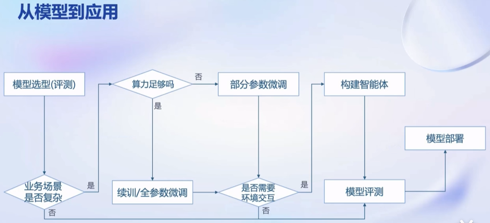
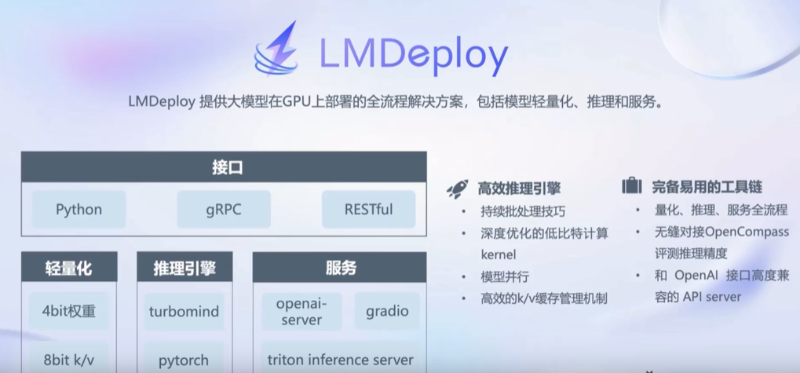
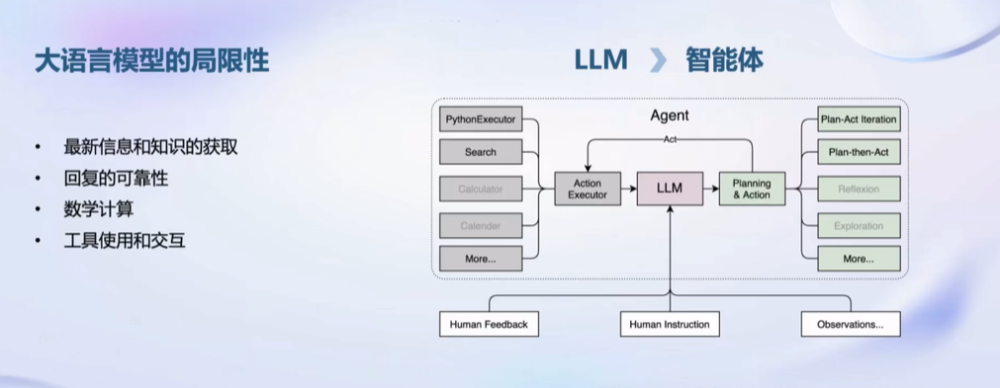
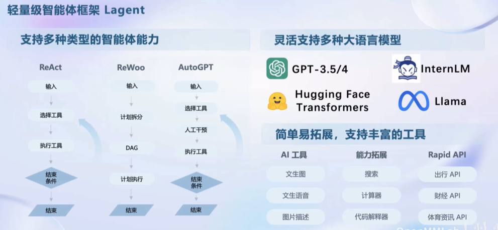
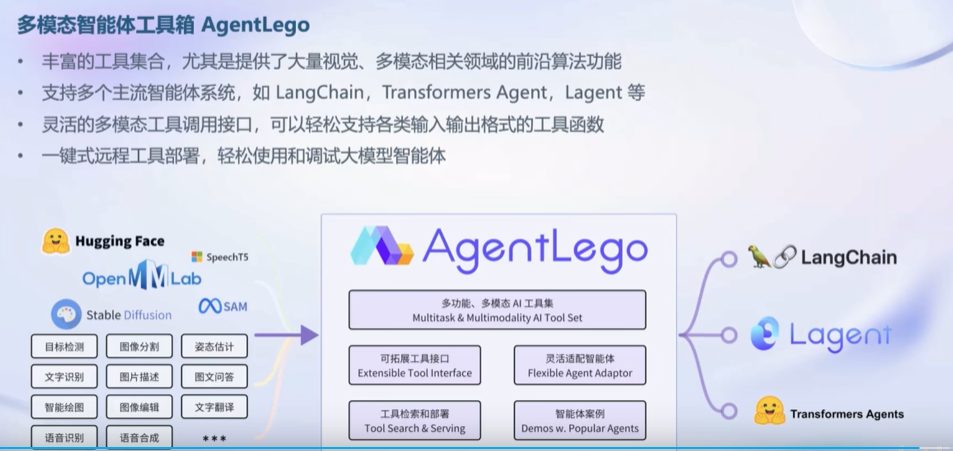

# 书生浦语大模型全链路开源体系
```
课堂笔记 孙大谦 fxlt
```
## 人工智能发展路径

   专用模型向通用大模型发展
   专用模型针对特定任务，一个模型解决一个问题
   通用大模型应对多种任务、多种模态

## 书生浦语大模型系列

|名称|参数规模|支持特性|
|----|----|----|
|InternLM-7B|70亿 轻量级|部署容易 8k语境长度 具备通用工具调用能力，支持多种工具调用模板 万亿训练token数据 信息全面 能力多维|
|InternLM-20B|200亿 中量级|推理能力更高 3k训练语境推理可外推至16k|
|InternLM-123B|1230亿 重量级|极强推理能力、理解能力、对话能力，全面知识覆盖|可实现各类Agent

## 模型实现应用的路径


## 全链条开源开放体系

### 数据——书生万卷

多模态语料库 
文本 50亿文档 1TB
图像 2200万 140G
视频 1000个 900G

多模态 精细化 价值观对齐

开源数据平台——OpenDataLab
提供数据下载  模态30+ 数据集5400+ 数据大小80TB
支持灵活检索、高速下载、智能标注、高效采集

### 预训练——InternLM-Train

1. 支持扩展8卡->千卡 性能提升92%
2. 性能优化 加速50%
3. 兼容主流生态 huggingface
4. 开箱即用

### 微调——xTuner

垂直领域的增量续训和有监督微调两种方式

增量续训
    使用场景：让基座模型学习到一些新知识，如垂直领域知识
    训练数据：文章、书籍、代码

有监督微调
    使用场景：让模型学会理解和遵循各种指令，或者注入少量领域知识
    训练数据：高质量对话、问答数据

xTuner:

1. 支持任务类型：增量与训练、指令微调、工具类指令微调
2. 数据格式：Alpaca Moss OpenAI Guanocao
3. 训练引擎：huggingface MMengine
4. 优化加速：Flash Attention、DeepSpeed ZeRO、Pytorch FSDP
5. 支持算法：QLoRa、LoRA、全量参数微调
6. 硬件：NVIDIA RTX 20系 8G

### 部署——LMDeploy


### 评测——OpenCompass

六个维度 80个评测集 40万评测题目

### 应用——LagentAgentLego





