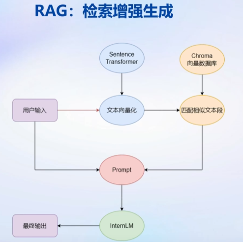

# 基于InternLM和langChain搭建你的知识库

## LLM局限性

1. 知识时效性受限
2. 专业能力受限
3. 定制化成本高

如何让LLM能够获取最新的知识
如何打造垂直领域大模型
如何打造个人专属的LLM应用

## 两条技术栈：RAG VS Finetune

1.RAG（检索增强生成）：LLM+知识库

    成本低
    可实时更新
    受基座模型影响大
    单次回答知识有限

sss

2.Finetune（微调）
新数据集构成Lora

    可个性化微调
    知识覆盖面广
    成本高昂 GPU算例 大数据集
    无法实时更新

## langchain框架

## 构建向量数据库

## 搭建知识助手

## web demo 搭建过程

## 知识库助手实战

https://github.com/InternLM/tutorial/tree/main/langchain

